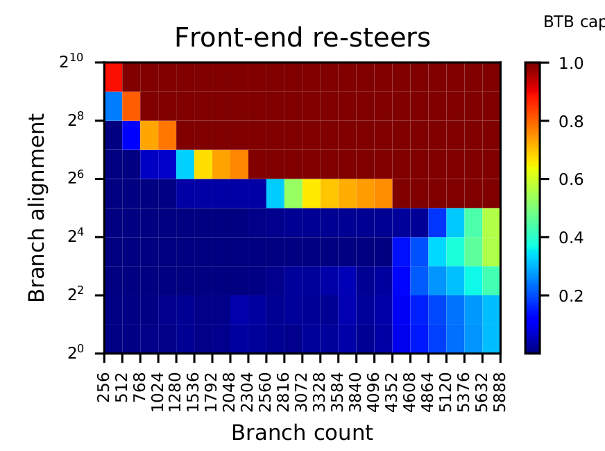
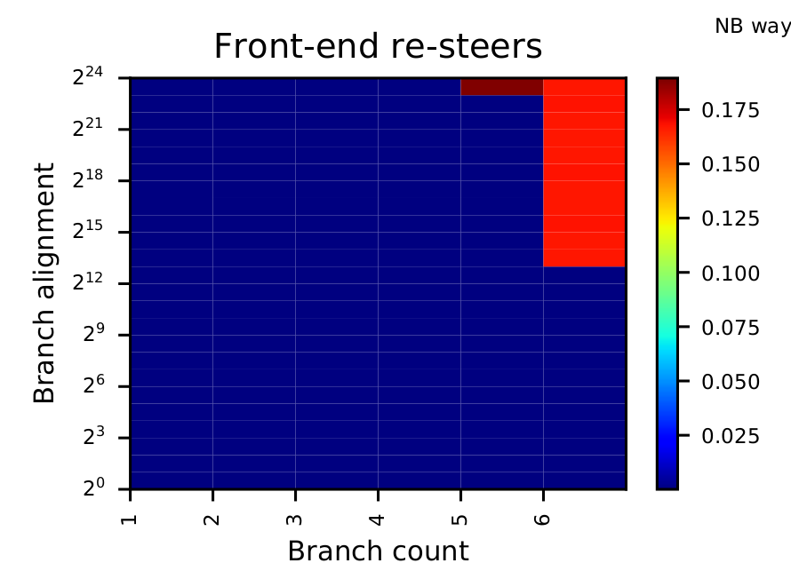
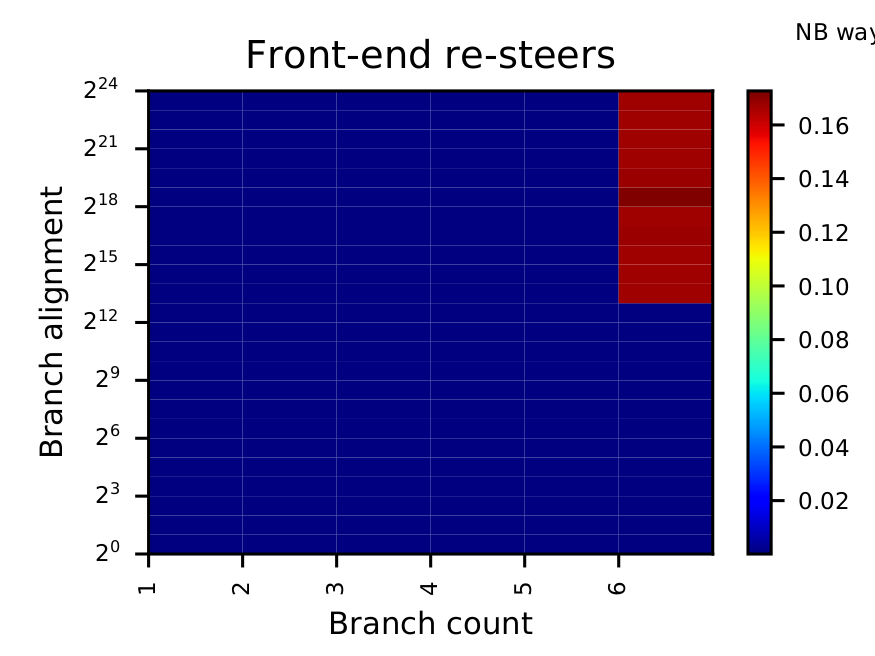
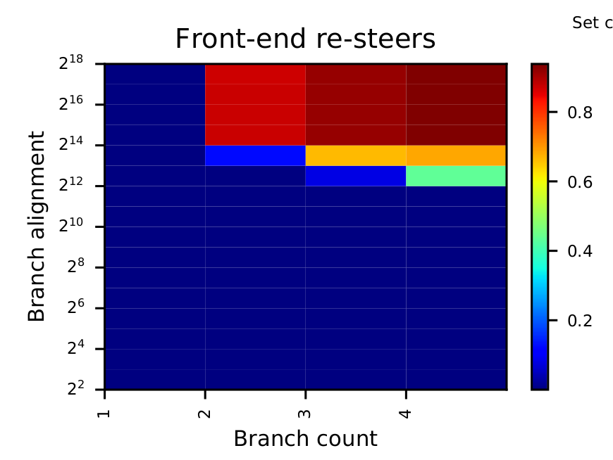
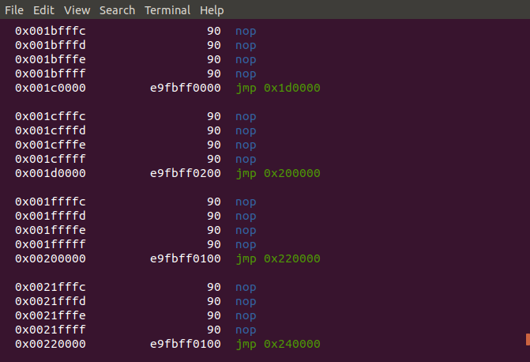

## Changes

### Alignment to 2^0

Modified the various test files in order to include an alignment to 2^0 bits (previously starting at 2^1).

### Mean instead of min

Taking the mean of the 100 runs for each test instead of the minimum for more consistent results (Godbolt used the minimum)
The writer of the Agner tool used to read the Intel performance registers recommends to repeat a run 100 times in order to compensate for some inaccuracies of the counters.

### Other performance register

Instead of the clock cycles, I display the number of mis-predicted conditional branches (see step02 for more details) in order to be able to sanity check that only our unconditional direct branches are affecting the testing outcome.

### Improvements on Godbolt's tests

I modified his tests and wrote additional ones in order to be able to better analyze the differences with his results.

### No NASM optimizations

Added the `-O0` flag for the nasm compilation to specify to not do any optimizations, see [nasm doc](https://nasm.us/doc/nasmdoc2.html)

But did not see any change from before or after the change.

## Observations

### BTB capacity test

The capacity test takes two variables N the number of branches and D the distance (alignment) in memory between these branches.

The goal is to fit a maximum number of branches into the BTB in order to be able to determine its size (number of entries) and possibly some other parameters  such as the number of ways, number of sets, which bits are used for the index or tag as well as the allocation and eviction policies or at least provide a starting point for further analysis.


**Hypothesis:** We expect a low mis-prediction rate  (observed as front-end re-steers) when the number of branches is equal to or lower than the number of entries of the BTB as they all fit in. Above that number, we expect to see an increasing number of mis-predictions as the cache needs to evict some previous content in order to make space for the new branch, the increase of the rate will vary depending on the replacement policy.

The branch alignment will influence the outcome if the Instruction Pointer (IP) of the branches is used in the determination of the set index and tag: thee different branches will be mapped to different sets and ways.



We can observe that the maximum number of branches that we can fit into the BTB without some mis-predictions independent of the alignment is **4096**. Above that number, we start experiencing some mis-predictions due a full cache and the need to evict some previous branch.

We have 5 alignments that allow us to fit 4096 branches into the BTB: 2^0, 2^1, 2^2, 2^3 and 2^4 so we can assume that the address space over which these branches are distributed allow a uniform distribution over the number of ways and sets in the BTB (otherwise we would be seeing a non-null mis-direction rate).


### Number of ways naive test

A naive approach to find an estimate for the number of ways of the BTB.

**Hypothesis:**  No matter the alignment, we always fit 2 instructions without a re-steer in a 2-way cache, 4 in a 4-way cache, etc because there is a hash function for the set index and the tag.

If we proceed with a naive approach, we could simply test how many branches can be fit into the BTB no matter the alignment. We can only proceed if we assume that the set index determination is not a simple subset of the branch's IP but a more complex hashing-like function that uniformly distributed the branches over the cache even if their addresses are close to each other.

We can observe that we can always fit 5 branches into the BTB without any re-steers:



In order to further test the hypothesis about the existence of a hash function, we can run the same test scenario but before the first branch, start with an extra offset so that the addresses of the branches are higher up that before but the relative differences (the alignment) remain the same. If a specific portion of the IP were used for the set index, we would observe some differences specifically in the lower alignment values which is not the case:



So it seems that we have a 5-way associative cache which is surprising as one would rather expect a 4-way associative cache given the analysis done on previous generations of Intel CPUs.

Additionally, this test gives us a first idea of the replacement policy used by the BTB: indeed we observe a ~16% mis-prediction rate for 6th branch (and an alignment higher than 2^12) which leads us to believe that the last branch does not evict one of the 5 previous ones as 1/6 = 16.6% which corresponds to our observations. This eliminates the possibility of a basic replacement policy (LRU, FIFO, LFU, etc) but indicates the use of a bit to avoid the eviction of active branches. The detailed replacement policy requires more specific tests.

### Set collisions and eviction sets

In order to be able to analyze the hashing function for the tag and index bits, we need to build an eviction set i.e. find several branch addresses which are put into the same set and therefore evict each other.

This will allow us to do two things:

- Analyze the hashing function and try to determine if it is an XOR-like function or something else
- Analyze the eviction policy, this will be easiest with a minimal eviction set but can also be achieved with any eviction set as long as we know how many elements it contains and some probabilistic reasoning and tests.

To find an initial eviction set, I ran several random pairs <N,D> with a small number of branches and different values for the alignment in order to find a specific set of branches that do collide. To increase the probability of two branches being in the same cache set I added several sub-branches of different sizes to increase the address diversity. Therefore the previous `OneJump` macro used to repeat a certain branch changed as follow (the actual number of branches is therefore the branch count N * 4 ):

```nasm
%macro OneJump 0
jmp %%next
align {align}*1
%%next: jmp %%next2
align {align}*2
%%next2: jmp %%next3
align {align}/2
%%next3: jmp %%next4
align {align}*2
%%next4:
%endmacro
```

Due to the constraints of the [nasm align](https://nasm.us/doc/nasmdoc4.html#section-4.11.13) macro, which requires a power of 2 as parameter, I decide to only change the alignment in small steps. It fills the specified byte number with `nop` instructions in order to create the desired spacing between the branches.

From the results, we know that the 16 branches generated by N=4 and D=2^12 result in a mis-prediction rate of ~50% which seems to be a good starting point for further analysis of the hashing function and the eviction policy:



We can then analyze our executable test file using [radare2](https://rada.re/n/radare2.html) to find our branches which are easily identifiable by the fact that they are next to our `nop` sequences generated by the `align` command:



Instructions on how to use `radare2` and process the output, the parser `find_jmps.py` can be found in the `tools` folder of the repo if needed.
```bash
cd src/out # move to the location of the executable
r2 -d test # load the binary file into radar2

>>> dcu entry0 # If we want the physical addresses, run this line, otherwise not
>>> /R jmp > output.txt # to write all jmps into the output.txt file
>>> q # leave radare2

python find_jmps.py output.txt # Runs a parser to locate our jmps and prints them
```

For the case N=4 and D=2^12, the virtual addresses are as follows:

```
  V address           hex instr    instr            binary conversion
  0x00006200         e9fb0d0000  jmp 0x7000  --- 00000000 00000000 01100010 00000000
  0x00007000         e9fb0f0000  jmp 0x8000  --- 00000000 00000000 01110000 00000000
  0x00008000         e9fb070000  jmp 0x8800  --- 00000000 00000000 10000000 00000000
  0x00008800         e9fb170000  jmp 0xa000  --- 00000000 00000000 10001000 00000000
  0x0000a000         e9fb0f0000  jmp 0xb000  --- 00000000 00000000 10100000 00000000
  0x0000b000         e9fb0f0000  jmp 0xc000  --- 00000000 00000000 10110000 00000000
  0x0000c000         e9fb070000  jmp 0xc800  --- 00000000 00000000 11000000 00000000
  0x0000c800         e9fb170000  jmp 0xe000  --- 00000000 00000000 11001000 00000000
  0x0000e000         e9fb0f0000  jmp 0xf000  --- 00000000 00000000 11100000 00000000
  0x0000f000         e9fb0f0000  jmp 0x10000 --- 00000000 00000000 11110000 00000000
  0x00010000         e9fb070000  jmp 0x10800 --- 00000000 00000001 00000000 00000000
  0x00010800         e9fb170000  jmp 0x12000 --- 00000000 00000001 00001000 00000000
  0x00012000         e9fb0f0000  jmp 0x13000 --- 00000000 00000001 00100000 00000000
  0x00013000         e9fb0f0000  jmp 0x14000 --- 00000000 00000001 00110000 00000000
  0x00014000         e9fb070000  jmp 0x14800 --- 00000000 00000001 01000000 00000000
  0x00014800         e9fb170000  jmp 0x16000 --- 00000000 00000001 01001000 00000000
```

The physical ones are the following:

```
 PH address       hex instr      instruction
0x55aa2ec87200   e9fb0d0000   jmp 0x55aa2ec88000
0x55aa2ec88000   e9fb0f0000   jmp 0x55aa2ec89000
0x55aa2ec89000   e9fb070000   jmp 0x55aa2ec89800
0x55aa2ec89800   e9fb170000   jmp 0x55aa2ec8b000
0x55aa2ec8b000   e9fb0f0000   jmp 0x55aa2ec8c000
0x55aa2ec8c000   e9fb0f0000   jmp 0x55aa2ec8d000
0x55aa2ec8d000   e9fb070000   jmp 0x55aa2ec8d800
0x55aa2ec8d800   e9fb170000   jmp 0x55aa2ec8f000
0x55aa2ec8f000   e9fb0f0000   jmp 0x55aa2ec90000
0x55aa2ec90000   e9fb0f0000   jmp 0x55aa2ec91000
0x55aa2ec91000   e9fb070000   jmp 0x55aa2ec91800
0x55aa2ec91800   e9fb170000   jmp 0x55aa2ec93000
0x55aa2ec93000   e9fb0f0000   jmp 0x55aa2ec94000
0x55aa2ec94000   e9fb0f0000   jmp 0x55aa2ec95000
0x55aa2ec95000   e9fb070000   jmp 0x55aa2ec95800
0x55aa2ec95800   e9fb170000   jmp 0x55aa2ec97000

With the corresponding binary conversions:

01010101 10101010 00101110 11001000 01110010 00000000
01010101 10101010 00101110 11001000 10000000 00000000
01010101 10101010 00101110 11001000 10010000 00000000
01010101 10101010 00101110 11001000 10011000 00000000
01010101 10101010 00101110 11001000 10110000 00000000
01010101 10101010 00101110 11001000 11000000 00000000
01010101 10101010 00101110 11001000 11010000 00000000
01010101 10101010 00101110 11001000 11011000 00000000
01010101 10101010 00101110 11001000 11110000 00000000
01010101 10101010 00101110 11001001 00000000 00000000
01010101 10101010 00101110 11001001 00010000 00000000
01010101 10101010 00101110 11001001 00011000 00000000
01010101 10101010 00101110 11001001 00110000 00000000
01010101 10101010 00101110 11001001 01000000 00000000
01010101 10101010 00101110 11001001 01010000 00000000
01010101 10101010 00101110 11001001 01011000 00000000
```

Which we can analyze to see in a specific XOR-like hashing function results in the approximate number of cache set collision we observed in our experiments.

Try XOR-7 or XOR-8 as mentioned in the "Translation Leak-aside Buffer: Defeating [...]" paper as a first approach. The hash function used for the TLB very probably is not the same as the one for the BTB but it is a start.

Yielding the following bits that would be used to index the cache sets (functions can be found in the Jupyter notebook `tools/XOR_hash_analysis.ipynb`)

```
XOR-7 on eviction set
[0, 0, 0, 0, 0, 1, 1]
[0, 0, 0, 0, 0, 1, 1]
[0, 0, 0, 0, 1, 0, 0]
[0, 0, 0, 0, 1, 0, 0]
[0, 0, 0, 0, 1, 0, 1]
[0, 0, 0, 0, 1, 0, 1]
[0, 0, 0, 0, 1, 1, 0]
[0, 0, 0, 0, 1, 1, 0]
[0, 0, 0, 0, 1, 1, 1]
[0, 0, 0, 0, 1, 1, 1]
[0, 0, 0, 1, 0, 0, 0]
[0, 0, 0, 1, 0, 0, 0]
[0, 0, 0, 1, 0, 0, 1]
[0, 0, 0, 1, 0, 0, 1]
[0, 0, 0, 1, 0, 1, 0]
[0, 0, 0, 1, 0, 1, 0]

-> All sequences of bits appear twice which corresponds to our 50% eviction rate, assuming that these bits are used for the set index.

XOR-8 on eviction set
[0, 0, 0, 0, 0, 0, 1, 1]
[0, 0, 0, 0, 0, 0, 1, 1]
[0, 0, 0, 0, 0, 1, 0, 0]
[0, 0, 0, 0, 0, 1, 0, 0]
[0, 0, 0, 0, 0, 1, 0, 1]
[0, 0, 0, 0, 0, 1, 0, 1]
[0, 0, 0, 0, 0, 1, 1, 0]
[0, 0, 0, 0, 0, 1, 1, 0]
[0, 0, 0, 0, 0, 1, 1, 1]
[0, 0, 0, 0, 0, 1, 1, 1]
[0, 0, 0, 0, 1, 0, 0, 0]
[0, 0, 0, 0, 1, 0, 0, 0]
[0, 0, 0, 0, 1, 0, 0, 1]
[0, 0, 0, 0, 1, 0, 0, 1]
[0, 0, 0, 0, 1, 0, 1, 0]
[0, 0, 0, 0, 1, 0, 1, 0]

-> All sequences of bits appear twice which corresponds to our 50% eviction rate, assuming that these bits are used for the set index.
```

But we would expect the BTB to use physical addresses

If we take the total size of 4096 entires and split it over 4-ways (which seems more realistic than the potential 5-way associativity found earlier), we would have 1024 entries per way meaning that we need log_2(1024) = 10 bits to index that range.


Assume a XOR-10 function on the bits Physical_address[34:14], we find the following results:

```
(0, 0, 1, 0, 0, 0, 0, 1, 1, 0): 8 occurences
(0, 0, 1, 0, 0, 0, 0, 1, 0, 1): 7 occurences
(0, 0, 1, 0, 0, 0, 0, 1, 1, 1): 1 occurence
```

Which is a mapping that matches our ~50% re-steer rate on our eviction set.

We need to run the same hash function on other eviction sets to validate or invalidate the possibility of that function being used.


### Replacement policies

Potential candidates: LRU, LFU, FIFO with an additional bit to avoid evicting "hot" branches.

Test scenarios: take the eviction set previously found and repeat some of the jumps in specific orders and see how it affects the mis-prediction rate (re-steers).

Implement this with indirect jumps back, as potentially have an iBTB, indirect BTB, (as found in the older Pentium M processor in Vladimir Uzelac's thesis) if we have separate register to count the mis-prediction rates of indirect branches, we can separate their impact from the direct ones but still be able to analyze the eviction policy of the BTB as the conditional branches use their own iBTB.

Alternatively conditional branches could also be an alternative depending on the registers we can use -> see step02.